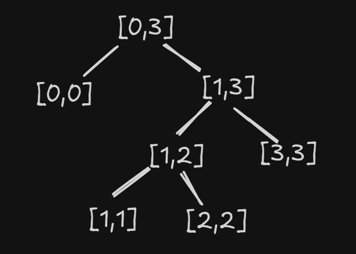
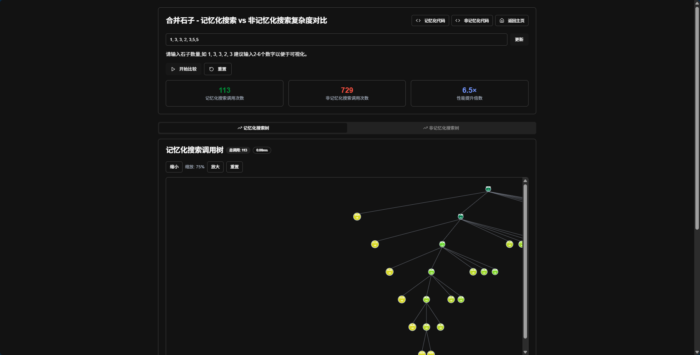
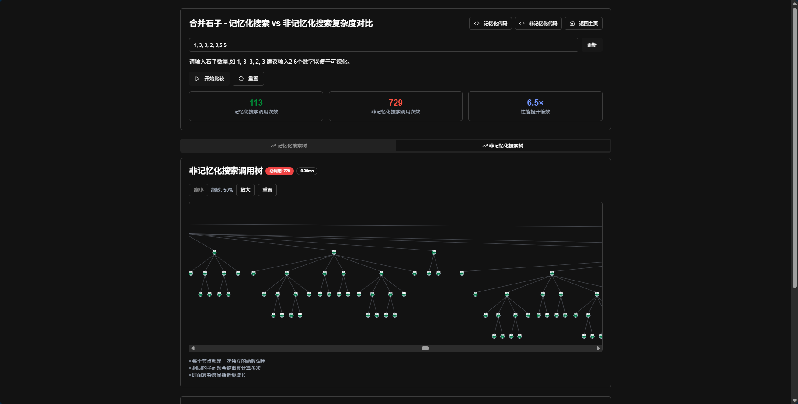

# 石子合并模拟

## 主题
本作品通过可视化的方式模拟石子合并问题，展示不同算法（正解for循环的dp，记忆化搜索以及非记忆化搜索的解法及其复杂度对比、非正解的类哈夫曼编码的贪心做法的局限性），帮助用户深入理解算法思想。
## 在线预览
[石子合并模拟](http://dp.agiantii.top/)
## 作品特色/难点/创新点
- 自定定义的 石子合并模拟
- 回溯 最优解的 合并过程
- 记忆化搜索 和 非记忆化搜索 的复杂度可视化对比
- 可视化 类哈夫曼编码的贪心解法，初学时的错误解法

## 作品内容详细描述
本作品主要包含以下内容：
### 1. 回溯最优解的合并过程
通过动画展示最优解的合并路径，帮助用户直观理解算法的执行过程。
实现：
#### 在dp方程转移时保存最优解即可
ai想的更聪明一些，只用 split[i][j] 来记录 合并 [i,j]最优解的分割点 k，而本人最初的想法比较笨，用 split[i][j]  来记录 合并 [i,j]最优解的 两个合并区间 [[i,k],[k+1,j]] 
#### 通过回溯函数 `generateSteps`，根据 `steps` 数组重建最优合并路径
```javascript
[
    {
        "left": 0,
        "right": 1,
        "cost": 4,
        "description": "合并区间 [0, 0] 和 [1, 1]，代价: 4",
        "mergedStones": [
            1,
            3,
            3,
            2,
            4
        ],
        "mergeLeft": 0,
        "mergeRight": 1,
        "splitPoint": 0,
        "intervals": [
            {
                "start": 0,
                "end": 0
            },
            {
                "start": 1,
                "end": 1
            },
            {
                "start": 2,
                "end": 2
            },
            {
                "start": 3,
                "end": 3
            },
            {
                "start": 4,
                "end": 4
            }
        ],
        "highlightIndices": [
            0,
            1
        ]
    },
    {
        "left": 0,
        "right": 2,
        "cost": 7,
        "description": "合并区间 [0, 1] 和 [2, 2]，代价: 7",
        "mergedStones": [
            4,
            3,
            2,
            4
        ],
        "mergeLeft": 0,
        "mergeRight": 2,
        "splitPoint": 1,
        "intervals": [
            {
                "start": 0,
                "end": 1
            },
            {
                "start": 2,
                "end": 2
            },
            {
                "start": 3,
                "end": 3
            },
            {
                "start": 4,
                "end": 4
            }
        ],
        "highlightIndices": [
            0,
            1
        ]
    },
    {
        "left": 3,
        "right": 4,
        "cost": 6,
        "description": "合并区间 [3, 3] 和 [4, 4]，代价: 6",
        "mergedStones": [
            7,
            2,
            4
        ],
        "mergeLeft": 3,
        "mergeRight": 4,
        "splitPoint": 3,
        "intervals": [
            {
                "start": 0,
                "end": 2
            },
            {
                "start": 3,
                "end": 3
            },
            {
                "start": 4,
                "end": 4
            }
        ],
        "highlightIndices": [
            1,
            2
        ]
    },
    {
        "left": 0,
        "right": 4,
        "cost": 13,
        "description": "合并区间 [0, 2] 和 [3, 4]，代价: 13",
        "mergedStones": [
            7,
            6
        ],
        "mergeLeft": 0,
        "mergeRight": 4,
        "splitPoint": 2,
        "intervals": [
            {
                "start": 0,
                "end": 2
            },
            {
                "start": 3,
                "end": 4
            }
        ],
        "highlightIndices": [
            0,
            1
        ]
    }
]
```
- 根据 steps 可视化过程即可,但是ai在这一步却始终不能只靠自己来修复bug，由于石子的位置在合并过程中会发生变化，所以需要在每次合并后更新石子的位置，确保可视化的正确性。
##### 具体做法
######  做法1.
在每次模拟的时候，用 结构体{st,ed}  来存储 石子的区间信息，在每次合并时候，这个数组也跟着模拟，并且，可以通过 每次模拟时候扫一遍数组，就可以知道 这个 两个合并的区间具体在这次模拟中处于石头的什么位置
初始情况 ，假设有3堆石头 [1, 2, 3]，那么初始的区间数组为：
```javascript
[
    { start: 0, end: 0 }, // 石子1
    { start: 1, end: 1 }, // 石子2
    { start: 2, end: 2 }  // 石子3
]
```
最优解的合并 为 [0,0] & [1,1] 
```javascript
[
    { start: 0, end: 1 }, // 合并后的石子1和石子2
    { start: 2, end: 2 }  // 石子3
]
```
最优解的合并情况为 [0,1]&[2,2]我们只需要扫一遍数组，就可以知道 [0,1]和[2,2] 在这次模拟中处于石头的什么位置。更具体一点，我们只需要找到 [0,1]的位置即可
###### 做法2 
我们将合并过程看出一颗树

当最优解中某一步 为  `[l1,r1] [l2,r2]` 时，我们想要知道 `[l1,r1] [l2,r2]` 在什么位置，由于这两区间相邻，我们只要关注`[0,l1-1]` 区间内有多少石头即可,又因为每次合并`[l1,r1] [l2,r2]` 会让`[l1,r2]` 的石头数-1,更进一步，因为 合并`[l1,r1] [l2,r2]`后，不可能有后续的合并操作发生在`[l1,r2]`中，所以我们看作 只对 `l1`这个位置的石子数-1,之后我们就可以用 树状数组等数据结构来维护`[0,l1]`区间内的石子数了。
这样的做法复杂度更低

但是 在石头上标注区间的会使得可视化更加清晰，最终还是选择做法1
### 2. 记忆化搜索与非记忆化搜索的对比
通过可视化对比两种方法的效率差异，帮助用户理解记忆化搜索的优势。


ps:
聪明的ai没想到在样式上始终不能只靠自己来修复bug，
可能是我说的的不够准确，svg的图可能会过大，导致树无法完成显示，提供具体解决方案(
dfs时候计算深度常量 和 第一层的宽度 作为svg的宽度 和 深度常量作为svg的高度 最后在svg的 container设置 overflow: auto;属性
)后，ai便轻松解决
### 3. 错误解法的演示
展示类哈夫曼编码的贪心解法，分析其局限性和错误之处。

## 运行
- 安装依赖
```
npm install pnpm -g
```

```
pnpm instal
```

- 启动项目
```
pnpm run dev
```